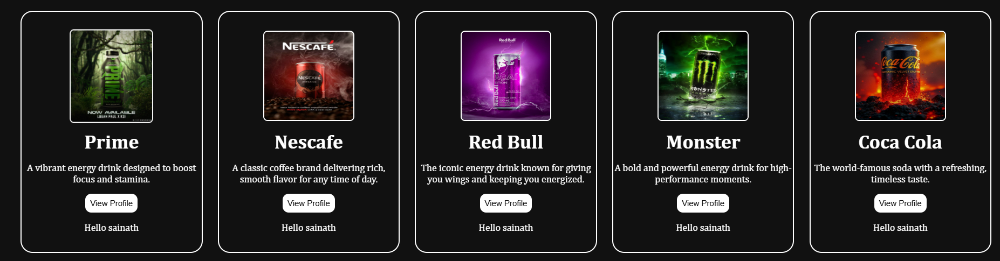

# In this file we used scss and scss compiler for styling the component also we created card component

React Js:-

In this Module We have Learned Following Important Topics:-

# What is component:-

React follows the component based architecture. So we divide the UI into multiple blocks. Component is a reusable piece of ui.There are two types of components
1.Functional Components:- In this component we use javascript functions that returns jsx.we can use any type of function such as js regular function or arrow function.
for ex:-
function App(){
return (<h1>Hello</h1>)
}

const App = ()=>{
return (<h1>Hello</h1>)
}

2.Class Component (older way) :- In this component we use classes that extends React.Component and for using state and props we have to use this keyword.
for ex:-
import React, { Component } from 'react';

class Welcome extends Component {
render() {
return <h1>Hello, {this.props.name}!</h1>;
}
}

# How to Call Component:-

We can Call component just like we call function or by using jsx syntax.but to call using function we have to use javasctipt { }
for ex:-
<App/>
App()

# Creating Component Folder:-

To maitaing the folder structure we create Component folder in src which will help us to organize the all the components

# What is Props:-

Props stand for properties. They are used to pass data from one component to another component via attributes.
Props pass the data to a component as a single object, and later we can destructure the values from it.
Props are used to make components reusable. They are immutable, which means we cannot change the values of props inside a component.In other words, props are read-only data.Props follow one-way data flow, which means data flows from parent to child.
We cannot pass data from a child component to a parent component using props.

# What is Prop Drilling:-

Prop Drilling is a situation that occurs when we need to pass data from one component to a deeply nested child component.
In this case, there are multiple intermediate components that don’t require the data themselves, but because of React’s one-way data flow, we still have to pass the data through them.
This process of passing data through multiple unnecessary layers of components is known as prop drilling.

# Extracting the data From prosp

1. Accessing Props Directly Without Destructuing
   for ex:-
   function Card(props){
   return {
   <h1>{props.name}</h1>
   }
   }

2. Destructuring Props inside function body
   for ex:-
   function Card(props){
   const {name} = props
   return {
   <h1>{name}</h1>
   }
   }

3. Destructuring Props Directly inside Function Parameter
   for ex:-
   unction Card({name}){

    return {
        <h1>{name}</h1>
    }

}

